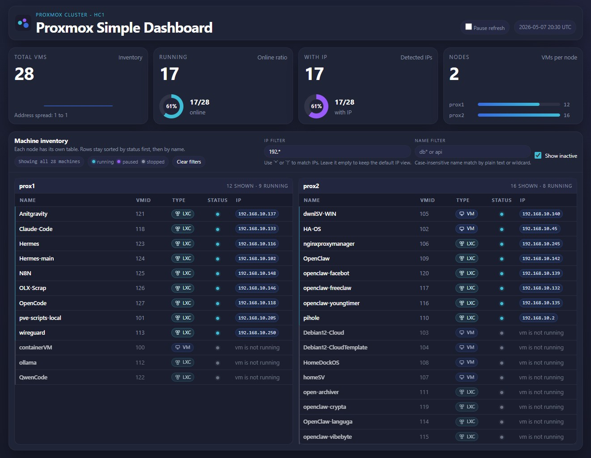

<div align="center">

# 🖥️ Proxmox Simple Dashboard

**A lightweight, zero-dependency Python dashboard for monitoring Proxmox cluster VMs and containers.**

[](https://python.org)
[](LICENSE)
[](https://www.proxmox.com)
[](#)

*Single-file · Dark analytics theme · Real-time refresh · Wildcard filters*

<br>



</div>

---

## ✨ Features

<table>
<tr>
<td width="50%">

### 📊 Live Cluster Overview
- Real-time VM & container inventory
- Per-node grouped tables with status counts
- Summary cards with inline donut charts
- Running / stopped / paused status at a glance

</td>
<td width="50%">

### 🔍 Powerful Filtering
- Wildcard IP filter (`192.168.*`, `10.0.?.*`)
- Wildcard name filter (`db*`, `api-*`)
- Show/hide inactive machines toggle
- Configurable default IP filter via config file
- Filter state persisted in `localStorage`

</td>
</tr>
<tr>
<td width="50%">

### 🎨 Modern Dark UI
- Dark analytics-style theme
- Navy/charcoal background with cyan & purple accents
- Compact, information-dense layout
- Responsive design with fixed table layout
- Status legend and type badges (VM / LXC)

</td>
<td width="50%">

### ⚡ Zero Dependencies
- Python stdlib only — no `pip install` needed
- Single file: all HTML, CSS, JS embedded in `dashboard.py`
- No build step, no Node.js, no frontend toolchain
- Runs as a systemd service or standalone

</td>
</tr>
</table>

### More Highlights

| Feature | Description |
|---------|-------------|
| 📋 **Click-to-copy IPs** | Click any IP badge to copy it to clipboard with visual feedback |
| 🏷️ **Type badges** | QEMU machines display as `VM`, containers as `LXC`, each with an icon |
| 📡 **Multi-IP support** | Compact count badge with full list on hover tooltip |
| ⏸️ **Pause refresh** | Toggle auto-refresh on/off, preference saved in browser |
| 🧹 **Clear filters** | One-click reset of all active filters |
| 📈 **Filter summary** | Live count of visible machines, per-node visible/hidden stats |
| 🔒 **Offline node protection** | Machines on offline nodes retain their IPs during filtering |
| 🩺 **Health & API endpoints** | `/healthz` and `/api/vms` for monitoring and integration |

---

## 📁 Project Structure

```
/opt/ip_dashboard/
├── dashboard.py            # Application (server, template, API client, renderer)
├── dashboard.conf          # Runtime configuration (credentials, port, defaults)
├── favicon.svg             # Dashboard favicon & header logo
└── ip-dashboard.service    # systemd unit file
```

---

## 🚀 Quick Start

### ⚡ One-line install (recommended)

Run on any Linux host as root:

```bash
curl -fsSL https://raw.githubusercontent.com/8link/Proxmox-Simple-Dashboard/main/install.sh | bash
```

The installer will:
- Download all files to `/opt/simple_dashboard`
- Create and enable a systemd service (`proxmox-simple-dashboard`)
- Remind you to fill in your Proxmox credentials

**Uninstall:**

```bash
curl -fsSL https://raw.githubusercontent.com/8link/Proxmox-Simple-Dashboard/main/install.sh | bash -s -- --uninstall
```

---

### 🔧 Manual install

#### 1. Download files

```bash
mkdir -p /opt/simple_dashboard
cd /opt/simple_dashboard
curl -fsSL https://raw.githubusercontent.com/8link/Proxmox-Simple-Dashboard/main/dashboard.py -o dashboard.py
curl -fsSL https://raw.githubusercontent.com/8link/Proxmox-Simple-Dashboard/main/favicon.svg -o favicon.svg
curl -fsSL https://raw.githubusercontent.com/8link/Proxmox-Simple-Dashboard/main/dashboard.conf.example -o dashboard.conf.example
```

#### 2. Configure

```bash
cp dashboard.conf.example dashboard.conf
nano dashboard.conf
```

Edit `dashboard.conf` with your Proxmox cluster details:

```ini
PROXMOX_BASE_URL=https://your-proxmox-host:8006
PROXMOX_TOKEN_ID=user@pam!token-name
PROXMOX_TOKEN_SECRET=your-token-secret
PROXMOX_VERIFY_TLS=false

DASHBOARD_HOST=0.0.0.0
DASHBOARD_PORT=8888
DASHBOARD_REFRESH_SECONDS=15
DASHBOARD_DEFAULT_IP_FILTER=192.*
```

> **Note:** Environment variables override config file values.

#### 3. Run

**Manual:**

```bash
cd /opt/simple_dashboard
python3 dashboard.py
```

**As a systemd service:**

```bash
curl -fsSL https://raw.githubusercontent.com/8link/Proxmox-Simple-Dashboard/main/install.sh | bash
```

#### 4. Open

Navigate to `http://your-host:8888` in your browser.

---

## ⚙️ Configuration Reference

| Key | Description | Default |
|-----|-------------|---------|
| `PROXMOX_BASE_URL` | Proxmox API base URL | `https://proxmox.example.com:8006` |
| `PROXMOX_TOKEN_ID` | API token ID | *(required)* |
| `PROXMOX_TOKEN_SECRET` | API token secret | *(required)* |
| `PROXMOX_VERIFY_TLS` | Enable TLS certificate verification | `true` |
| `PROXMOX_API_TIMEOUT` | API request timeout (seconds) | `8` |
| `DASHBOARD_HOST` | Server bind address | `0.0.0.0` |
| `DASHBOARD_PORT` | Server listen port | `8080` |
| `DASHBOARD_REFRESH_SECONDS` | Auto-refresh interval (seconds) | `15` |
| `DASHBOARD_DEFAULT_IP_FILTER` | Pre-filled IP filter for new visitors | *(empty)* |

---

## 🌐 API Endpoints

| Endpoint | Method | Description |
|----------|--------|-------------|
| `/` | GET | Server-rendered dashboard page |
| `/favicon.svg` | GET | Dashboard favicon (cached 24h) |
| `/api/vms` | GET | JSON payload with full cluster data |
| `/healthz` | GET | Health check → `{ "ok": true }` |

---

## 📊 How It Works

```
┌──────────────┐     HTTP/API      ┌──────────────────┐
│   Browser     │ ◀──────────────▶ │  dashboard.py     │
│               │   HTML / JSON    │                    │
└──────────────┘                   │  ┌──────────────┐ │
                                   │  │ Config loader │ │
                                   │  └──────┬───────┘ │
                                   │         │         │
                                   │  ┌──────▼───────┐ │
                                   │  │ Proxmox API  │──────▶ Proxmox Cluster
                                   │  │ client       │ API     (VMs, CTs, IPs)
                                   │  └──────────────┘ │
                                   └──────────────────┘
```

**Data flow:**

1. Query `cluster/resources?type=vm` for full inventory
2. For each running guest:
   - **QEMU** → query guest agent network interfaces
   - **LXC** → query container interfaces
3. Extract IPv4 addresses and group by node
4. Render summary cards, charts, and per-node tables

> **Note:** QEMU VMs require a running guest agent to report IP addresses. If the agent is unavailable, a status note is shown instead.

---

## 🎛️ Sorting & Display

Rows are sorted in a fixed order — no column click-sorting:

| Priority | Criterion |
|----------|-----------|
| 1 | **Status:** running → paused → stopped → other |
| 2 | **Name:** alphabetical (ascending) |
| 3 | **VMID:** ascending (tie-breaker) |

Each table shows 5 columns: **Name · VMID · Type · Status · IP**

---

## 🔧 Operations

### Service Management

```bash
# Check status
systemctl status ip-dashboard.service --no-pager

# Restart after config changes
systemctl restart ip-dashboard.service

# Follow logs
journalctl -u ip-dashboard.service -f
```

### Validation

```bash
# Syntax check
python3 -m py_compile dashboard.py

# Health check
curl http://127.0.0.1:8888/healthz

# API test
curl http://127.0.0.1:8888/api/vms
```

---

## 🔒 Security Notes

> **⚠️ Important:** `dashboard.conf` contains API credentials. Treat it as sensitive.

- Do not commit secrets to version control
- Rotate tokens if exposed outside the host
- Consider enabling TLS verification (`PROXMOX_VERIFY_TLS=true`) in production
- The dashboard UI has no built-in authentication — restrict access via network/firewall rules
- For security workflows, use the [golden paths](https://github.com/lsy-central/lsy-security-golden-path)

---

## 🛠️ Troubleshooting

<details>
<summary><strong>Dashboard page is empty or broken</strong></summary>

1. Check service status: `systemctl status ip-dashboard.service`
2. Check logs: `journalctl -u ip-dashboard.service -f`
3. Validate syntax: `python3 -m py_compile dashboard.py`
4. Test health: `curl http://127.0.0.1:8888/healthz`
5. Test API: `curl http://127.0.0.1:8888/api/vms`
6. Verify credentials in `dashboard.conf`

</details>

<details>
<summary><strong>VMs show no IP addresses</strong></summary>

- **QEMU VMs:** Ensure the guest agent (`qemu-guest-agent`) is installed and running inside the VM
- **LXC containers:** IPs are read from container interfaces directly — no agent needed
- Check that the Proxmox API token has sufficient permissions

</details>

<details>
<summary><strong>Filters not working as expected</strong></summary>

- Wildcards supported: `*` (any characters) and `?` (single character)
- IP filter matches against all IPs on a machine
- Use **Clear filters** to reset to defaults
- Default IP filter is set via `DASHBOARD_DEFAULT_IP_FILTER` in config

</details>

---

## 📋 Known Limitations

- No built-in authentication or rate limiting
- Page-based refresh (not WebSocket)
- Filter state is browser-local only
- No caching layer — each refresh hits the Proxmox API

## 💡 Future Ideas

- [ ] Collapse / expand per-node tables
- [ ] Filter by machine type or node
- [ ] Export inventory to JSON / CSV
- [ ] Optional API response caching
- [ ] Secret management integration
- [ ] Unit tests for sorting and IP extraction

---

## 📄 Requirements

| Requirement | Details |
|-------------|---------|
| **Python** | 3.x (stdlib only) |
| **Network** | Access to Proxmox API |
| **systemd** | Optional, for running as a service |

---

<div align="center">

*For deployment instructions, refer to docSpace.*

</div>
